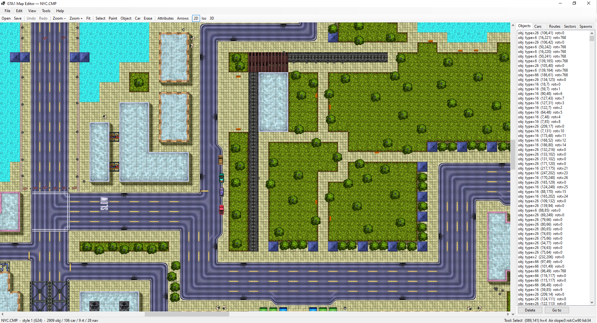
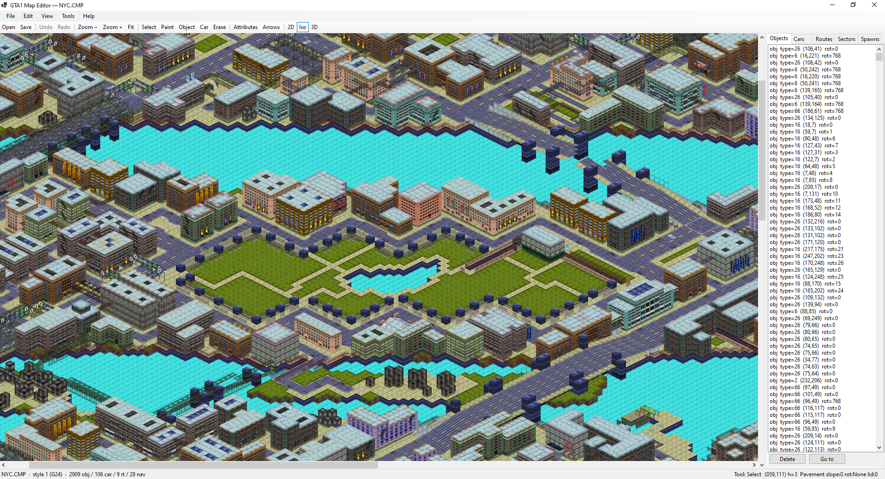
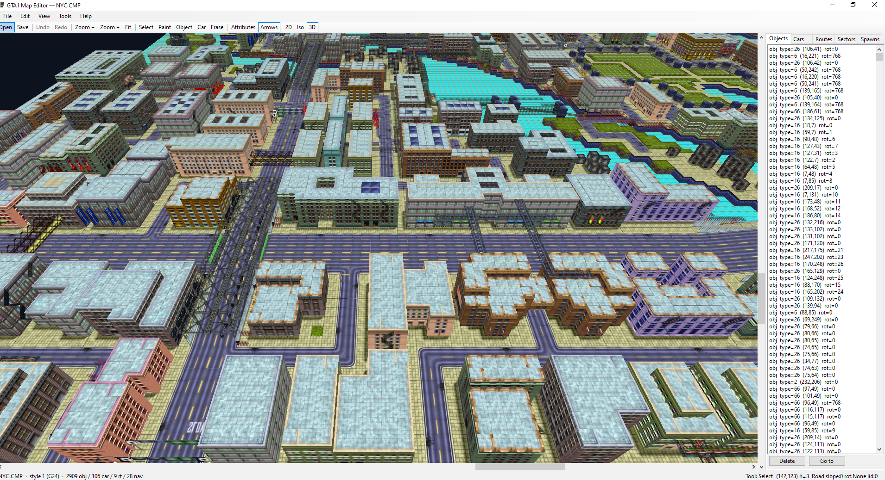

# GTA1 Map Editor

A Windows desktop editor for **Grand Theft Auto 1** `.CMP` map files (with `.G24` style data). Spiritual successor to the original **Junction25** editor, written in C# / .NET 8 with WinForms + OpenTK.

Reads stock maps directly from the original game (`NYC.CMP`, `SANB.CMP`, `MIAMI.CMP`), renders them with the same tile graphics the game itself uses, and lets you edit blocks, objects, vehicles, and spawn locations with full undo/redo.

By [vbgamer45](https://github.com/VBGAMER45)

## Screenshots

**2D top-down** — pure orthographic view, what Junction25 shows. Tile graphics decoded straight from `.G24`; placed cars and objects render with their actual G24 sprites at correct rotation.



**2.5D isometric** — dimetric projection, full lid + wall mesh with depth-buffered occlusion. Same atlas, slope-aware lids.



**3D free-look** — perspective camera, WASD + right-drag mouse-look. Scrollbars pan horizontally; Q/E adjust elevation.



---

## Status

Functional. Decoded G24 tile output is **byte-identical** to the engine's own reference (verified by an automated diff against pre-extracted reference PNGs in the [companion web port](https://github.com/VBGAMER45/gta) — full coverage in `tests/GTA1MapEditor.Tests/TileDecodeVsPngTests.cs`).

### What works

- **Map I/O**
  - Read & round-trip-write GTA1 `.CMP` files (full header, base, columns, blocks, objects, car positions, routes, nav sectors, spawn locations).
  - Read `.G24` style files (tiles, animation, paged CLUTs, palette indices, object info, car info, sprite info & graphics, sprite numbers).
- **Views** (toggle via toolbar / Ctrl+1/2/3)
  - **2D top-down** — every block's lid in stack order, so transparent overlays composite correctly. Pan, wheel-zoom, scrollbars, Fit/100% native (`Ctrl+9`).
  - **2.5D isometric** — dimetric projection, full lid + wall mesh, depth-buffered.
  - **3D free-look** — WASD + right-drag mouse-look + Q/E elevation.
- **Editing**
  - Block attributes panel (Junction25-style): per-tile cube type, slope, rotation, walls, lid, traffic flags, railway flags, brightness remap, z-stack navigator.
  - Section-aware tile picker (Side / Lid / Aux) with sprite previews.
  - Place / move / delete objects, cars, and spawn locations (Police / Hospital / Fire). Drag entities by clicking and dragging in Select mode; right-click for properties dialog.
  - Tile paint tool with eyedropper (right-click).
  - **Sprite-based entity rendering** in 2D top-down — placed cars and objects show their actual G24 sprites with correct rotation, not placeholder markers.
  - Clone-on-write per-tile editing keeps shared block records intact.
  - Full undo / redo (`Ctrl+Z` / `Ctrl+Y`).
- **Quality of life**
  - File → Open Recent (last 5 maps).
  - Edit → Go to Tile (`Ctrl+G`).
  - Side panel listing every Object / Car / Route / Sector / Spawn with Go-to + Delete.
  - Traffic-direction arrow overlay (`F2`).
  - Automatic G24 lookup: opens a `.CMP`, finds the matching `styleNNN.g24` in sibling folders.
  - Optional pre-extracted PNG tiles fallback (used automatically when `tiles/{side,lid,auxiliary}/*.png` are present beside the style).

### Known caveats

- Per-block remap colour variations not yet applied — all tiles render at the base palette (remap 0).
- 3D tile picking is ground-plane only — clicking a tall building selects its footprint.
- Iso/3D entity rendering still uses solid markers; sprite billboards in those views are pending.
- Routes and nav sectors are list-editable (select + delete) but no in-canvas polyline / rectangle drawing tool yet.
- Walls render at full block height even when the block above slopes — they poke through sloped lids visually.

---

## Build & run

Requires the .NET 8 SDK and the .NET 8 WindowsDesktop runtime.

```bash
dotnet build
dotnet test
dotnet run --project src/GTA1MapEditor.App
```

Then **File → Open `.CMP`**. If the matching `styleNNN.g24` lives in a sibling `styles/` folder (the common layout in the [web port](https://github.com/VBGAMER45/gta)), it's auto-loaded; otherwise you'll be prompted.

Stock GTA1 install paths are also fine:
```
C:\GTA1\EXTRACTED\Program_Executable_Files\GTADATA\NYC.CMP
```

---

## Project layout

```
src/
├── GTA1MapEditor.Core/         pure .NET — parsers, models, undoable commands
│   ├── CmpReader.cs, CmpWriter.cs        — .CMP I/O (byte-exact round trip)
│   ├── G24Reader.cs                       — .G24 parser
│   ├── Palette.cs, SlopeGeometry.cs, SpriteRenderer.cs
│   ├── MapEditor.cs                       — clone-on-write tile edits
│   ├── Commands/                          — IEditCommand stack
│   └── Models/                            — BlockInfo, CmpMap, G24*, MapObject, CarPosition, ...
├── GTA1MapEditor.Rendering/    — OpenTK renderers
│   ├── TileAtlas.cs, AtlasTexture.cs, SpriteCache.cs
│   ├── MapMesh.cs                          — shared 3D lid+wall mesh
│   ├── MapView2D.cs, MapViewIso.cs, MapView3D.cs
│   ├── IMapView.cs                         — renderer abstraction
│   └── GlShader.cs
└── GTA1MapEditor.App/          — WinForms shell
    ├── MainForm.cs, MapViewControl.cs, EditorState.cs
    ├── TileAttributesForm.cs, TilePickerForm.cs
    ├── ObjectPickerForm.cs, CarPickerForm.cs, SpawnTypeForm.cs
    ├── MapListsPanel.cs                    — Objects/Cars/Routes/Sectors/Spawns tabs
    ├── GoToTileForm.cs, RecentFiles.cs, AboutForm.cs
    └── PngTileSource.cs                    — optional pre-extracted PNG fallback

tests/GTA1MapEditor.Tests/      xUnit
   - CmpReaderTests, CmpWriterTests, G24ReaderTests
   - TileDecodeVsPngTests        — byte-level diff against reference PNGs
```

---

## File format notes

The G24 binary format has six non-obvious quirks worth knowing before touching the decoder. The canonical reference for our editor is [Carnage3D](https://github.com/codenamecpp/carnage3d)'s `src/StyleData.cpp`; the [web port](https://github.com/VBGAMER45/gta) is a useful secondary reference.

1. **File tile 0 is a reserved blank slot.** The first real side tile lives at file index 1. Both pixel addressing and CLUT lookup need a `+1` shift relative to a naive 0-based read.
2. **`paletteIndices` stores 4 CLUT entries per tile** (one per remap variant 0..3). Total tile-CLUT count = `4 × tileCount`.
3. **Tile pixels are laid out as a 4-tile-wide page**, not flat consecutive 4096-byte blocks. The section is padded to a 4-tile-row boundary.
4. **CMP block bytes are 1-based and section-relative.** Wall byte N → atlas slot `N − 1` (side section). Lid byte N → atlas slot `sideCount + N − 1` (lid section). 0 means "no texture".
5. **`object_info` dimensions are signed 32-bit, not 16-bit.** Record stride is 20 bytes (12 dims + 2 baseSprite + 2 weight + 2 aux + 1 status + 1 numInto) plus `numInto * 2` of `into[]`.
6. **CMP `CarPosition.Type` is a `ModelId`, not an array index.** Look the car up in `car_info` by matching the `ModelId` field.

---

## Credits & references

- **[Junction25](https://www.gtamodding.com/wiki/Junction25)** — original DMA Design map editor; UX inspiration.
- **[Carnage3D](https://github.com/codenamecpp/carnage3d)** — C++ GTA1 reimplementation by codenamecpp; canonical source for binary format details.
- **[OpenGTA](https://github.com/garrick-/opengta)** — additional decoding reference.
- **[gta-web-port](https://github.com/VBGAMER45/gta)** — companion TypeScript port; provides reference tile PNGs and a working CMP/G24 parser.

GTA1, GTA2, GTA London 1969 and GTA London 1961 are registered trademarks of Rockstar Games, Inc. This is a fan-made editor for the original 1997 game; no game assets are redistributed.

---

## License

See [LICENSE](LICENSE).
